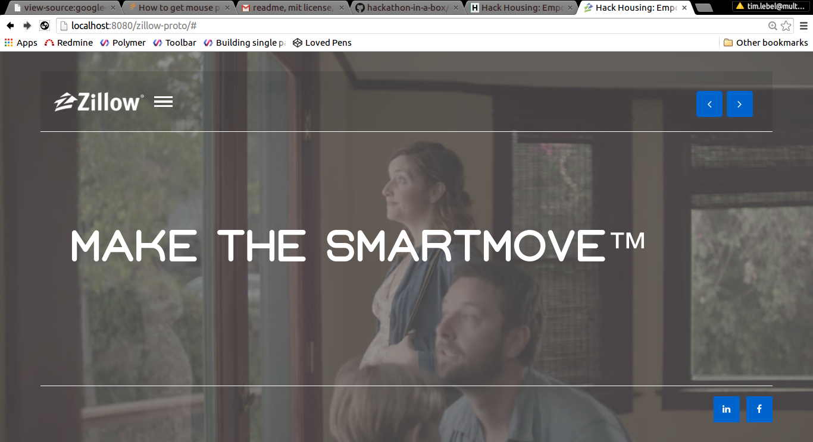

# SmartMove: Live smarter, not harder

A web application that uses data from HUD EGIS and Google Maps to assist low-income renters and
beneficiaries of government programs move closer to work and to the things that matter to them.

This application was created as a submission for the [Zillow Hack Housing Hackathon](http://hudegis.github.io/)

## Using GeoInformation to make smart housing decisions

The application allows the user to enter a series of locations, along with how often they visit each of
them. For most people, work will be the most frequent one. However, people have more complex needs.
A user may be taking care of an elderly loved one, participating in an education program, or doing
volunteer work or community services. By allowing an arbitrary number of locations, we get a more
nuanced picture of the user's lifestyle.

The app then computes a polygon based on those locations representing the optimal area where that user
could live to be close to their commitments. There are placeholders to gather more information about
government programs they may qualify for and their income, and to use these factors to make suggestions
of available assistance programs.

## Using the HUD data

After computing the user's optimal living area (which we are calling their "habitat") we show a map of
it. The toggle buttons overlay real data from the HUD APIs about housing projects, multifamily homes
and housing counseling providers in that area. The ones falling inside the habitat are highlighted.

## The SpaceLab Team

* [David Puerto](http://codepen.io/dapinitial) -- UI/UX Designer, Front-End Developer
* [Tim Lebel](http://github.com/tmlbl) -- Full-Stack Polyglot CodeWizard
* [Jake Grajewski](http://github.com/thecavepeanut) -- Full-Stack TypeScript Troll

### Installation of Required Tools

1. NodeJs/npm (http://nodejs.org)
2. tsd `sudo npm i -g tsd@next`
3. grunt-cli `sudo npm i -g grunt-cli`
4. TypeScript `sudo npm i -g typescript`

### Getting Started
1. cd into maps (cd path/to/zillow/www/maps)
2. ./build.sh
3. cd (../../)
4. node server.js
5. localhost:8080/maps/index.html
